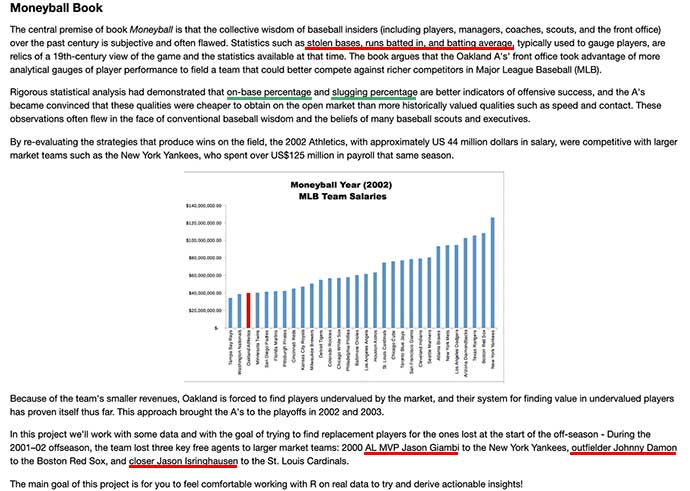

# Capstone Project

Practice project 1 for Udemy course ["Data Science and Machine Learning Bootcamp with R"](https://www.udemy.com/course/data-science-and-machine-learning-bootcamp-with-r/), based on the Moneyball film and book.

## Project description

The objective is to replace Oakland Athletics beisbol team's key players with replacement players while adhering to the following constrains:

* The total combined salary of the three players can not exceed 15 million dollars.
* Their combined number of At Bats (AB) needs to be equal to or greater than the lost players.
* Their mean OBP had to equal to or greater than the mean OBP of the lost players

_(Last updated, April 2020)_
